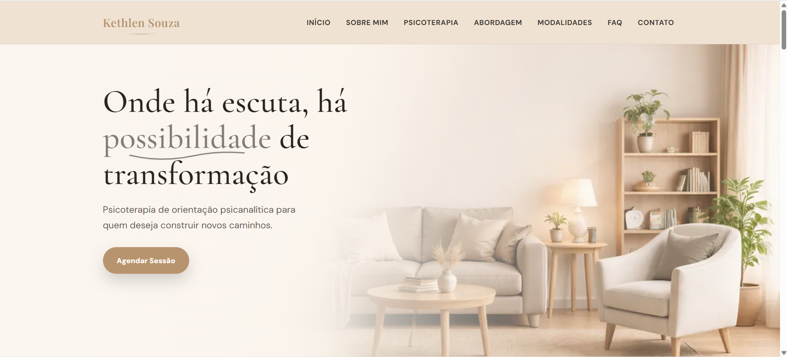

# 🧠 Psicóloga Kethlen Souza — Website Institucional

<p align="center">
  <a href="https://assisfilipee.github.io/Site-Psicologa/" target="_blank">
    
  </a>
</p>

<p align="center">
  🔗 <strong><a href="https://assisfilipee.github.io/Site-Psicologa/" target="_blank">Ver projeto online</a></strong>
</p>

---

## 📌 Sobre o projeto

Website institucional desenvolvido para a psicóloga **Kethlen Souza**, com foco em:

✔️ Experiência acolhedora  
✔️ Identidade visual elegante e minimalista  
✔️ Navegação simples e intuitiva  
✔️ Conversão para agendamento de sessões  

O layout foi pensado para transmitir **confiança, leveza e profissionalismo**, alinhado ao posicionamento da área de psicologia.

---

## 🎯 Objetivos

- Apresentar a profissional e sua abordagem terapêutica  
- Explicar modalidades de atendimento  
- Facilitar o contato e agendamento  
- Criar presença digital profissional  

---

## 🧩 Funcionalidades

- ✅ Layout 100% responsivo  
- ✅ Menu hamburguer no mobile  
- ✅ Navegação por âncoras com scroll suave  
- ✅ Seção de abordagem terapêutica  
- ✅ Modalidades (online e presencial)  
- ✅ FAQ interativo  
- ✅ Botão de contato com WhatsApp  
- ✅ Animações sutis e elegantes  

---

## 🛠️ Tecnologias utilizadas

- HTML5  
- CSS3 (Flexbox + Grid)  
- JavaScript Vanilla  

---

## 📱 Responsividade

O site foi otimizado para:

- 📱 Smartphones  
- 💻 Desktop  
- 📲 Tablets  

Garantindo consistência visual e usabilidade em todos os dispositivos.

---

## 🎨 Conceito de design

O projeto segue princípios de:

- Design minimalista  
- Tipografia editorial  
- Paleta de cores neutra e acolhedora  
- Espaçamento generoso para melhor leitura  

---

## 🚀 Como executar localmente

```bash
# Clonar o repositório
git clone https://github.com/assisfilipee/Site-Psicologa.git

# Entrar na pasta
cd Site-Psicologa

# Abrir o index.html no navegador
